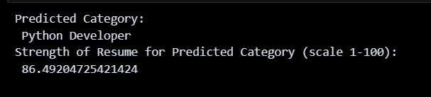

# ResumEase

_Streamlining Resume Screening and Job Role Categorization_

ResumEase is an innovative platform that leverages advanced natural language processing (NLP) and machine learning (ML) techniques to streamline resume screening and categorize job roles with precision. With ResumEase, recruiters can efficiently identify the most promising candidates and make informed hiring decisions.

## How to Use

1. **Dataset Usage**:
   - ResumEase utilizes two datasets: **UpdatedResumeDataSet** for resumes and **company_data_set** for company information.

2. **Test Resumes**:
   - Test resumes are available in the "testResumes" folder.
   - Each resume in the folder provides a unique output when processed through ResumEase.

     

3. **Incorporating Test Resumes**:
   - To include a test resume in the application:
     - Replace the file location of the resume file under the "Read PDF resume, extract text content" section.

         `pdf_file_path = "./testResumes/cv3.pdf"`

         

4. **Prediction and Scoring**:
   - The predicted category and score for each resume are displayed under the "Job Role Prediction and Scoring the resume" section.

   

5. **Eligible and Ineligible Companies**:
   - The eligible and ineligible companies for each resume are shown at the end of the process.

      

      

## Datasets Used

ResumEase utilizes two primary datasets:

1. **UpdatedResumeDataSet:** This dataset contains information about resumes, including domain names and skills.

   

2. **CompanyDataSet:** This dataset includes data about companies, including company names, domain names, and minimum scores needed for eligibility.

   

For more information, check out the Project Report: [report.pdf](./porjectReport/ResuEase-Report.pdf)
